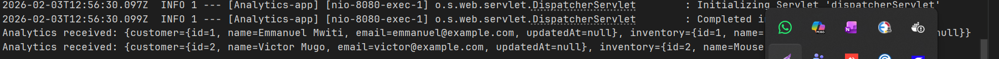

# Scalable Systems Integration Pipeline

## Overview
This project demonstrates a scalable integration pipeline using **Java Spring Boot producers** and **Python consumers** with **Kafka** as the message broker and **Redis** for idempotency.  
It fetches data from CRM and Inventory systems, merges it, and sends it to an Analytics system.  

# Scalable Systems Integration Pipeline

## Overview
This project demonstrates a scalable integration pipeline using **Java Spring Boot producers** and **Python consumers** with **Kafka** as the message broker and **Redis** for idempotency.  
It fetches data from CRM and Inventory systems, merges it, and sends it to an Analytics system.  


---

## Architecture & Design Decisions

- **Producers (Java Spring Boot)**
    - Fetch from CRM (`/customers`) and Inventory (`/products`) using `WebClient`.
    - Publish messages to Kafka topics: `customer_data` and `inventory_data`.
    - Retry logic with exponential backoff for failed API calls.
    - Modular design allows adding new data sources easily.

- **Consumers (Python asyncio + aiokafka)**
    - Asynchronously consume messages from Kafka topics.
    - Merge messages by `id` to create a combined JSON payload.
    - Deduplicate using Redis (`SHA256` hash keys, TTL 24 hours).
    - Retry failed posts to Analytics and log errors.

- **Message Broker (Kafka)**
    - Provides decoupling between producers and consumers.
    - Supports scalability via partitions.

- **Idempotency (Redis)**
    - Prevents duplicate processing of messages.

- **Scalability & Reliability**
    - Event-driven architecture allows multiple consumer instances.
    - Retry and backoff strategies for API/network failures.
    - Designed to handle 10,000+ records/hour.

---

## Prerequisites

- Docker & Docker Compose
- Java 17+ (for Spring Boot producers)
- Python 3.10+ (for consumers)

---

## Setup & Run

1. **Clone repository**
```bash
git clone git@github.com:Emmanuel-Mwiti/Integration-test.git
cd Integration-test
docker-compose up --build
docker ps
docker logs producer-app -f       # Check producers sending messages
docker logs consumer-app -f       # Check consumer merging and sending to analytics
docker logs analytics-mock -f    # Verify analytics received merged payloads
```
## Environment Variables (Docker Compose)

| Service       | Variable                     | Default     |
|---------------|-----------------------------|------------|
| Producer-App  | SPRING_KAFKA_BOOTSTRAP_SERVERS | kafka:9092 |
| Consumer-App  | KAFKA_BOOTSTRAP_SERVERS        | kafka:9092 |
| Consumer-App  | REDIS_HOST                     | redis      |

## Test Result
To test, You can directly:
```bash
docker logs analytics-mock -f  
```
Then see logs like:
```
Analytics received: {customer={id=1, name=Emmanuel Mwiti, email=emmanuel@example.com, updatedAt=null}, inventory={id=1, name=Laptop, stock=15, updatedAt=null}}  
Analytics received: {customer={id=2, name=Victor Mugo, email=victor@example.com, updatedAt=null}, inventory={id=2, name=Mouse, stock=50, updatedAt=null}}        

```


This is a log in the mock analytics, that is consuming the fianl refined data

*This image shows the test result.*

